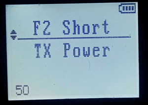
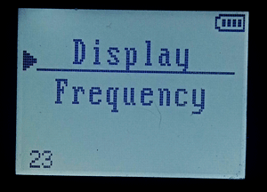

# OpenQUACK: проект ПО для портативных радиостанций Quansheng UV-K5/UV-K5(8)/UV-5R PLUS/UV-K6
А также Anysecu UV-K5, Radtel RT-590 и так далее  

https://t.me/openquack  

Основан на коде https://github.com/DualTachyon и https://github.com/fagci  

__Несовместим со штатным CPS, требует установки [кастомного модуля CHIRP](https://github.com/rebezhir/openquack-chirp-driver) !!!__  

  
ПО рассчитано на использование рации именно как средства связи, при этом средства удобного.

Поэтому удаляется все ненужное:
* Экран приветствия, дающий секундную задержку при загрузке
* Прием FM-радио, для боковой клавиши в настройках CHIRP заменено на переключение A/B (также доступно через меню рации)
* Передача сигнала тревоги, для боковой клавиши в настройках CHIRP и заменено на переключение VFO/MR (также доступно через меню рации)
* Прием NOAA по причине бесполезности в России
* Копирование по воздуху
* Киллкоды
* Соответствующие убираемым функциям пункты меню
* Озвучивание меню
  

# Добавлено: 
* Редактирование настроек боковых клавиш из меню рации  

    

* Увеличено усиление микрофона
* Расширен диапазон настройки длительности подсветки
* Горизонтальное меню V1.1  

  
* Расширенная блокировка кнопок (только цифровые / все, кроме PTT / все)  

Добавляется:  

* Переключение TDR по F+0 вместо радио

# TODO:
* Русифицированное горизонтальное меню  

  

* Расширенный редактор в меню (названия каналов, сканлисты, список контактов и т.д.)

  

# Из любопытного
* Удаление кода, отвечающего за FM-радио, экономит почти 4 кБ объема прошивки
