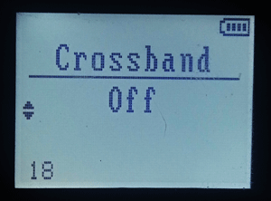

# OpenQUACK: проект ПО для портативных радиостанций Quansheng UV-K5/UV-K5(8)/UV-5R PLUS/UV-K6
_А также Anysecu UV-K5, Radtel RT-590 и так далее_  

__ОТПРАВИТЬ БЛАГОДАРОЧКУ НА ПИВО: 2204 1201 0314 6060__  
[Канал в Telegram](https://t.me/openquack)  

Основан на коде https://github.com/DualTachyon и https://github.com/fagci  

__Несовместим со штатным CPS, требует установки [кастомного модуля CHIRP](https://github.com/rebezhir/openquack-chirp-driver) !!!__  
На время работы над прошивкой самой рации доработка модуля приостановлена.  

  
ПО рассчитано на использование рации именно как средства связи, при этом средства удобного.

Поэтому удаляется все ненужное:
* Экран приветствия, дающий секундную задержку при загрузке
* Прием FM-радио, для боковой клавиши в настройках CHIRP заменено на переключение A/B (также доступно через меню рации)
* Передача сигнала тревоги, для боковой клавиши в настройках CHIRP заменено на переключение VFO/MR (также доступно через меню рации)
* Прием NOAA по причине бесполезности в России
* Копирование по воздуху
* Киллкоды
* Соответствующие убираемым функциям пункты меню
* Озвучивание меню
  

# Добавлено: 
* Редактирование настроек боковых клавиш из меню рации

    

* Увеличено усиление микрофона
* Расширен диапазон настройки длительности подсветки
* Отключен тайм-аут сканирования частоты и субтона
* Горизонтальное меню V1.1  

  
* Расширенная блокировка кнопок (только цифровые / все, кроме PTT / все)  
* Переключение TDR по F+0 вместо радио  
* Встроенная калибровка вольтметра в скрытом меню (PTT+F1 при включении рации)
* Быстрый реверс смещения может назначаться на любую боковую кнопку через меню рации  

# ПОРЯДОК КАЛИБРОВКИ ВОЛЬТМЕТРА:
1. __Полностью__ зарядить батарею и __оставить рацию во включенном стакане__. При калибровке автоматически прописывается именно та настройка, при которой показания АЦП контроллера будут соответствовать 8,4 В.
2. Войти в инженерное меню рации, включив ее с одновременно нажатыми PTT и верхней боковой клавишей.
3. Перейти к пункту 60 меню.
4. Однократно нажать кнопку MENU, затем EXIT.
5. Выключить рацию и снова включить.

# КАЛИБРОВКА ШУМОПОДАВЛЕНИЯ:
Первый уровень у него штатно слишком тупой, умудряющийся запирать даже мощный сигнал. Но, поскольку все калибровки для уровней шумоподавления хранятся в EEPROM, а не зашиты во флеш, исправить это в самой прошивке можно только костылем, подменяющим данные при SQL=1. Поэтому в репозиторий [добавлены скрипты на Python](https://github.com/rebezhir/openquack/tree/main/squelch-tuner) для чтения и записи калибровок в рацию.
В консоли, открытой из папки _squelch_tuner_:
>python squelch_table_write.py COM5 _(номер порта, естественно, должен соответствовать тому, на котором висит подключенный к рации шнур)_.

Настройки в файле для SQL=1 уже изменены.  
В файле можно поправить ВТОРЫЕ по порядку байты во всех элементах массива, например:

>uhf_squelch_open_rssi = bytearray([0x0a,__0x35__,0x53,0x56,0x59,0x5c,0x5f,0x62,0x64,0x66,0xff,0xff,0xff,0xff,0xff,0xff])

Если при открытии шумодава звук "квакает" (появляется только на пиках громкости и тут же исчезает), нужно увеличивать гистерезис, то есть разницу между _squelch_open_rssi_ и _squelch_close_rssi_. При этом в записи для скрипта всегда должно соблюдаться правило __squelch_open_rssi < squelch_close_rssi__.  
_squelch_open_noise_ и _squelch_close_noise_ отвечают за пороги срабатывания по шуму, _squelch_open_glitch_ и _squelch_close_glitch_ - за импульсные помехи.

Слева - заводские настройки, считанные через squelch_table_read.py с "чистой" рации, справа - с рации после применения скрипта. 

  

# TODO:
* Русифицированное горизонтальное меню 
* Расширенный редактор в меню (названия каналов, сканлисты, список контактов и т.д.)

  

